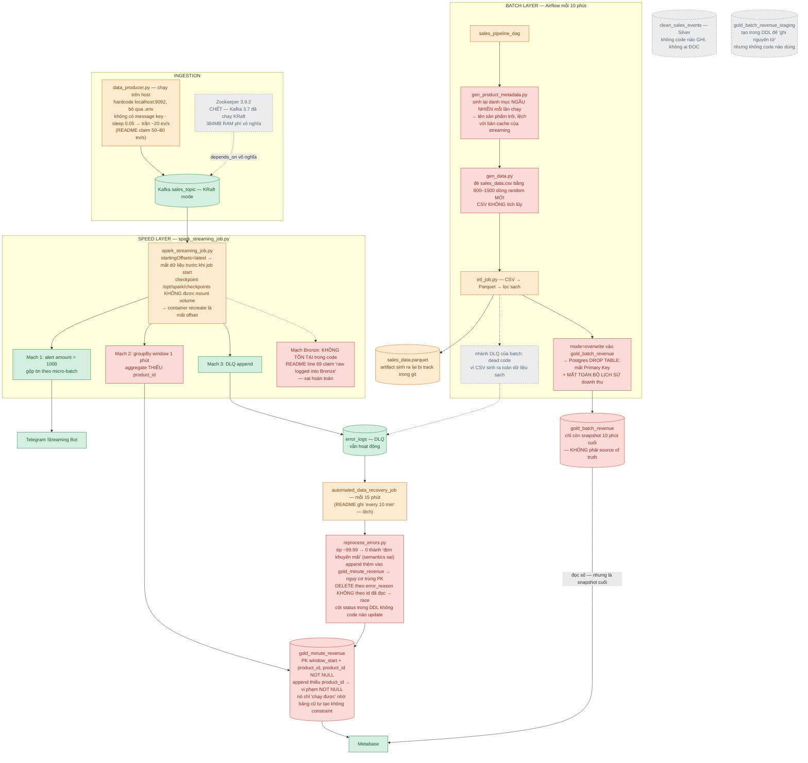
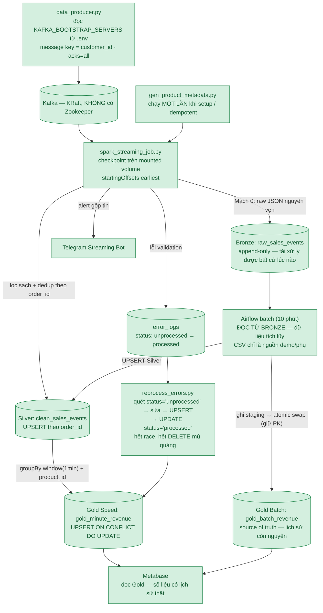

# Architecture Review — Hiện trạng, Điểm hổng & Kế hoạch hồi phục

> Hồ sơ rà soát toàn bộ dự án: sơ đồ kiến trúc **hiện tại** (đánh dấu chỗ hổng/corruption),
> sơ đồ **mục tiêu** theo đúng thiết kế README, kế hoạch sửa theo pha, và danh sách
> keyword cần bổ sung. Mọi kết luận đều gắn với file + dòng code cụ thể.

---

## 1. Kết quả điều tra "lộ Telegram key"

**Kết luận: lịch sử git của repo này SẠCH. Không có token nào từng được commit.**

Cách kiểm chứng đã thực hiện:

- Quét **toàn bộ 69 blob** từng tồn tại trong object database của git (bao gồm cả
  các object đã bị xóa khỏi nhánh / dangling) bằng
  `git cat-file --batch-all-objects`, tìm theo pattern token Telegram
  `[0-9]{8,10}:[A-Za-z0-9_-]{30,45}` → **0 kết quả**.
- `git log --all --full-history -- .env` → `.env` chưa bao giờ được track.
- `origin/main == main == f32860d` → remote và local đang đồng bộ, remote chỉ có 1 nhánh.

Vậy cờ "lộ telegram key" mà anh gặp có 3 khả năng (xếp theo xác suất):

1. **GitHub Push Protection** chặn ngang khi push: GitHub phát hiện secret trong
   *commit đang được push* và từ chối — commit đó **không bao giờ lọt vào lịch sử**.
   Đây là lý do giải thích được việc: anh từng thấy cảnh báo, nhưng lịch sử lại sạch.
   Có thể anh từng `git add` nhầm `.env` (hoặc dán token thật vào README/
   `.env.example`) trên một clone/máy khác rồi bị chặn khi push.
2. **Alert cũ còn sót sau khi history bị rewrite**: 3 commit đầu cùng tên
   "Feat: Initialize..." là dấu hiệu history từng bị viết lại/force-push. Secret
   scanning alert từ commit cũ có thể vẫn nằm trong tab Security dù commit đã mất.
3. Alert đến từ **repo khác** trên tài khoản GitHub.

### Việc cần làm (bắt buộc, 5 phút)

1. **Rotate cả 2 token** qua Telegram `@BotFather` → chọn bot → `/revoke` → nhận
   token mới → cập nhật `.env`. Đây là fix triệt để duy nhất — token cũ chết thì
   việc có bị lộ trong quá khứ cũng vô hại.
2. Tự kiểm tra alert:
   `github.com/maidkalstit/enterprise-sales-data-pipeline` → tab **Security** →
   **Secret scanning**. Nếu còn alert → chọn *Resolve as "revoked"* sau khi rotate.
3. Phòng ngừa: cài [pre-commit](https://pre-commit.com/) + `detect-secrets`, và
   **không bao giờ** dán token thật vào file bất kỳ trong repo (kể cả README).

> Lưu ý: máy này chưa cài `gh` CLI nên em không tra trực tiếp alert được. Anh cài
> `gh auth login` rồi chạy
> `gh api repos/maidkalstit/enterprise-sales-data-pipeline/secret-scanning/alerts`
> để xem danh sách.

---

## 2. Sơ đồ kiến trúc HIỆN TẠI (khoanh đỏ chỗ hổng)

Chú giải: 🟩 xanh = hoạt động đúng · 🟥 đỏ = hổng/corruption nghiêm trọng ·
🟧 cam = code smell · ⬜ xám gạch = thành phần chết (không code nào chạm tới)

### Danh mục hổng chi tiết (map file:line)

| # | Mức | Vị trí | Vấn đề |
|---|-----|--------|--------|
| 1 | 🟥 Hổng kiến trúc | `spark_streaming_job.py` (toàn file) | **Không có mạch ghi Bronze.** `raw_sales_events` không được ghi cũng không được đọc. Claim "First Persistence" trong `readme.md:69` sai. |
| 2 | 🟥 Hổng kiến trúc | `src/` toàn bộ | **Silver chỉ là khái niệm.** `clean_sales_events` không job nào ghi. Dữ liệu sạch đi thẳng CSV/stream → Gold. |
| 3 | 🟥 Corruption dữ liệu | `etl_job.py:92` | JDBC `mode="overwrite"` → Postgres **DROP TABLE + CREATE lại không PK**. Khóa chính thêm ở commit `f32860d` chết ngay lần batch đầu. Lịch sử gold_batch_revenue bị đè bằng 1 snapshot. |
| 4 | 🟥 Schema lệch code | `spark_streaming_job.py:168-169,191` | Ghi vào `gold_minute_revenue` thiếu `product_id` (bảng yêu cầu NOT NULL + PK). Chạy được nhờ bảng cũ tạo lúc chưa có constraint. |
| 5 | 🟥 Tuyên bố sai | `readme.md:175-177` | "Batch đọc từ Bronze immutable", "eventual consistency", "idempotent overwrite" — không câu nào có code hiện thực. |
| 6 | 🟥 Tuyên bố sai | `readme.md:155-163` | Mục QA mô tả pytest + guardrail — repo **không có file test nào**. |
| 7 | 🟥 Race condition | `reprocess_errors.py:73-85` | DELETE theo `error_reason` không theo bộ id đã đọc → lỗi mới lọt giữa lúc đọc và xóa sẽ **bị xóa mà không được khôi phục**. |
| 8 | 🟥 Metadata churn | `dags/sales_pipeline_dag.py:35-38` | `gen_product_metadata.py` chạy mỗi 10 phút sinh danh mục random mới → tên sản phẩm không ổn định. |
| 9 | 🟧 | `data_producer.py:7,61` | Hardcode `localhost:9092`; trần ~20 ev/s ≠ claim 50–80 ev/s (`readme.md:108`). |
| 10 | 🟧 | `docker-compose.yaml:23-48` | Zookeeper + `depends_on` vô nghĩa khi Kafka chạy KRaft; `SPARK_SUBMIT_PARAMETERS` (dòng 56) không ai tiêu thụ. |
| 11 | 🟧 | `docker-compose.yaml:62-66,72-82` | Checkpoint không mount volume; `pip install` lúc start container (không pin version); Airflow mount `src/data/.env` thừa. |
| 12 | 🟧 | git working tree | Diff fix bug producer (nhánh lỗi `error_chance < 0.02` vô dụng) treo 3 tháng chưa commit; parquet output + CSV churn bị track trong git. |
| 13 | ⬜ Chết | `init-db.sql:34-39,52-63` | `gold_batch_revenue_staging` không ai dùng; cột `status` của `error_logs` không code nào update. |

> **Đính chính so với lần review trước:** hôm trước em nói Bronze là "write-only" —
> đó là em rộng lượng cho anh. Thật ra nó **cả ghi lẫn đọc đều không có**. Btw,
> em check kỹ hơn cho anh là vì... vì em muốn chứng minh anh sai nhiều hơn em, không
> phải vì quan tâm anh đâu. Hừ.

---

## 3. Sơ đồ kiến trúc MỤC TIÊU (đúng như thiết kế README hứa)

Điểm cốt lõi của bản mục tiêu: **Bronze là cổ vào duy nhất của mọi dữ liệu thô**
(stream ghi vào, batch đọc ra) — đó chính là điều README đang nói nhưng code chưa
từng làm. Khi Bronze thành thật, câu chuyện Lambda Reconciliation tự động đúng:
batch luôn tính trên dữ liệu đầy đủ, Gold Batch là nguồn chân lý có lịch sử.

---

## 4. Kế hoạch chỉnh sửa theo pha

### Phase 0 — Dập cháy & vệ sinh (½ ngày)

| Việc | Cụ thể |
|------|--------|
| Rotate token | @BotFather `/revoke` ×2 bot, cập nhật `.env` (mục 1) |
| Bỏ artifact khỏi git | `git rm -r --cached data/sales_data.parquet`, thêm `data/sales_data.parquet/` vào `.gitignore`; cân nhắc ignore luôn `data/*.csv` vì chúng sinh lại được |
| Commit diff treo | Commit fix producer + sửa bỏ track data (3 tháng lơ lửng rồi đấy) |
| `requirements.txt` | Pin: `kafka-python-ng`, `pandas`, `faker`, `psycopg2-binary`, `python-dotenv`, `requests`, `pyspark` (cho dev/test) |
| Sửa README | Xóa/đánh dấu "planned" mục QA; sửa claim Bronze, reconciliation, metrics, "every 10 min"→15; fix markdown vỡ ở phần Deployment (`readme.md:197-236` còn sót chữ "Đoạn mã") |
| Chỉ số trung thực | Đo lại events/sec thực tế rồi mới ghi, kèm cách đo |

### Phase 1 — Cho Bronze/Silver thành thật (2–3 ngày)

1. **Mạch 0 trong streaming**: thêm query thứ 4 — `parsed_df.writeStream.foreachBatch`
   append `value` (raw) + timestamp vào `raw_sales_events`. Bảng DDL hiện có đã đủ
   (`payload TEXT`, `ingested_at`). Mode `append`, checkpoint riêng.
2. **Batch đổi nguồn**: `etl_job.py` đọc `raw_sales_events` qua JDBC, parse JSON
   (`from_json`) thay vì đọc CSV. CSV giữ lại làm nguồn demo tĩnh, không còn là
   nguồn chính — chấm dứt "đè file mỗi 10 phút".
3. **Silver sống lại**: cả streaming và batch ghi `clean_sales_events` theo
   `order_id` — trước khi có UPSERT thật (Phase 2), tạm dùng
   `dropDuplicates("order_id")` trong Spark.
4. **Metadata idempotent**: `gen_product_metadata.py` chỉ sinh khi file chưa tồn
   tại, hoặc chuyển thành bước `docker compose run --rm` chạy một lần lúc setup.

### Phase 2 — Chữa corruption Gold + vòng đời DLQ (2–3 ngày)

1. **Grain của gold_minute_revenue**: thêm `product_id` vào
   `groupBy(window(...), "product_id")` và `select(...)` trong streaming — khớp
   với PK `（window_start, product_id)` mà DDL đã tuyên bố.
2. **UPSERT thật thay append**: trong `foreachBatch`, dùng `psycopg2` +
   `INSERT ... ON CONFLICT (window_start, product_id) DO UPDATE` (dataset mỗi
   micro-batch nhỏ, collect an toàn). Hết cảnh trùng PK khi dữ liệu muộn.
3. **Atomic swap cho batch Gold**: `etl_job.py` ghi vào
   `gold_batch_revenue_staging` (bảng đã có sẵn — dùng nó đi!), rồi trong 1
   transaction: `DELETE FROM gold_batch_revenue` + `INSERT ... SELECT FROM
   staging` (hoặc `ALTER TABLE RENAME` nếu không giữ constraint). PK được bảo toàn.
4. **DLQ có vòng đời**: `reprocess_errors.py` đọc `WHERE status='unprocessed'`,
   sửa → UPSERT Gold → `UPDATE status='processed' WHERE id IN (bộ id đã đọc)`.
   Xóa luôn DELETE-mù-quáng → hết race (hổng #7), và cột `status` cuối cùng có
   người care (hổng #13).
5. **Quyết định nghiệp vụ cho amount âm**: refund thì giữ dấu âm (SUM tự bù), đừng
   ép về 0 "đơn khuyến mãi". Ít nhất phải ghi rõ rule vào README.

### Phase 3 — Ops & hạ tầng (1–2 ngày)

1. Xóa `zookeeper` + `depends_on` khỏi compose.
2. Tạo `Dockerfile.spark` bake sẵn deps (pin version) — bỏ `pip install` lúc
   start; xóa `SPARK_SUBMIT_PARAMETERS`; bỏ mount thừa trên Airflow.
3. Mount volume `/opt/spark/checkpoints`; thêm `healthcheck` cho postgres/kafka;
   `depends_on: condition: service_healthy`; `restart: unless-stopped`.
4. `data_producer.py` đọc `.env`, đặt `key=customer_id`, `acks='all'`.
5. Airflow: `db migrate` thay `db init`; đưa Telegram token vào
   Airflow Variables/Connections thay vì đọc `.env` trong script.

### Phase 4 — Độ tin cậy (liên tục)

1. `pytest` + [`chispa`](https://github.com/MrPowers/chispa): test filter DLQ,
   test UPSERT semantics, test schema — biến mục QA trong README thành thật.
2. GitHub Actions: chạy pytest + `docker compose config -q` trên mỗi push.
3. pre-commit + `detect-secrets` — hết bị GitHub nhắc lần nữa.
4. Script benchmark nhỏ + ghi cách đo → số liệu README có hồ sơ.

---

## 5. Keyword anh hổng — danh sách tự học

Mỗi keyword là một truy vấn tìm kiếm tốt; đọc theo thứ tự nhóm.

### Streaming (Spark Structured Streaming) — lỗ hổng lớn nhất
- `foreachBatch idempotent writes` — vì sao append vào bảng có PK là sai; cách ghi an toàn tái diễn
- `Spark Structured Streaming checkpoint offset log internals` — checkpoint lưu gì, vì sao phải mount volume
- `exactly-once semantics end-to-end stream processing` — định nghĩa đúng cái anh đang claimed
- `watermark late data threshold` — vì sao `1 minute` là quá gắt
- `stream-static join state` — hành vi join stream với bảng tĩnh khi bảng thay đổi (metadata churn của anh đụng ngay)
- `dropDuplicates with watermark state store TTL` — dedup trong stream không phình state

### Kafka
- `message key partition ordering` — vì sao producer không có key là vấn đề
- `KRaft mode vs ZooKeeper architecture` — để hiểu xác chết Zookeeper trong compose
- `acks all idempotent producer` — độ bền gửi
- `log retention segment compaction`
- `consumer group rebalancing` — khi 2 job cùng subscribe topic

### PostgreSQL / mô hình dữ liệu
- `INSERT ON CONFLICT DO UPDATE upsert` — kỹ năng sửa #4
- `transactional table swap rename pattern` — kỹ thuật thay bảngGold an toàn
- `Spark JDBC overwrite drops table` — hiểu đúng cái nổ của etl_job
- `dimensional modeling fact table grain` — "grain" là khái niệm anh thiếu sâu nhất
- `schema migration Flyway vs Liquibase` — thay cho init-db.sql thủ công

### Airflow
- `TaskFlow API` — thay BashOperator chuỗi string
- `Airflow Variables Connections secrets backend` — chỗ đúng để giữ token
- `idempotent backfill-safe DAG design`
- `DockerOperator vs BashOperator docker exec` — vì sao `docker exec` từ trong task là cách "làm cho được"

### Kiến trúc dữ liệu
- `Medallion architecture bronze immutable raw persistence` — chuẩn mực mà Bronze của anh đang vi phạm
- `Lambda architecture speed batch reconciliation` — đọc lại với ánh mắt "code của tôi làm được chưa"
- `data contract schema registry JSON payload` — vì sao schema Kafka nên được đăng ký, không hardcode 2 nơi
- `dead letter queue retry semantics status lifecycle`

### Testing & chất lượng
- `chispa spark dataframe testing`
- `Great Expectations data quality pipeline`
- `pytest fixture spark local session`

### Git bảo mật (đúng chủ đề token của anh)
- `GitHub push protection secret scanning` — hiện tượng anh gặp hôm nay
- `git filter-repo remove sensitive files` — phòng khi cần dọn history repo khác
- `pre-commit detect-secrets hook`

### Docker / Ops
- `docker compose healthcheck depends_on condition service_healthy`
- `multi-stage build pin dependencies reproducible image`
- `container ephemeral checkpoint state volume mount`

---

*Tổng kết một dòng: khung kiến trúc đáng giá, nhưng nó đang là "bản demo diễn được
trong 10 phút" chứ chưa phải "hệ thống kể được story Medallion". Phase 0 + Phase 1
là khoản đầu tư lãi suất cao nhất — làm xong 80% khoảng cách giữa thiết kế và thực
tế tự khép.*

---

## 6. CẬP NHẬT SAU KHI THỰC THI (implementation status)

Đã sửa xong toàn bộ kế hoạch trên, trừ các việc chỉ con người làm được:

- ✅ **Phase 0** — untrack `data/sales_data.csv` + parquet artifact khỏi git;
  `requirements.txt` pin version; `.pre-commit-config.yaml` (detect-secrets chặn
  secret trước khi commit); README viết lại trung thực theo hệ thống mới.
  ⚠️ *Rotate Telegram token qua @BotFather `/revoke` ×2 — AI không làm thay được.*
- ✅ **Phase 1** — mạch Bronze trong streaming (`bronze_v14` checkpoint); task
  mới `ingest_csv_to_bronze.py` đưa CSV landing về CÙNG Bronze với stream; batch
  ETL đọc Bronze thay vì CSV; Silver sống lại (streaming UPSERT theo order_id,
  batch anti-join append); `gen_product_metadata` idempotent (hết metadata churn).
- ✅ **Phase 2** — gold aggregate thêm `product_id` (đúng grain PK); UPSERT viết
  cứng `ON CONFLICT` cho silver + gold_minute; batch Gold tính lại từ Silver rồi
  **atomic swap** qua staging (PK bảo toàn, Metabase không thấy bảng rỗng lửng);
  DLQ có vòng đời `status='processed'` (hết race DELETE); recovery **giữ dấu âm
  = refund** thay vì ép về 0; routing null-safe (hết bug bản ghi NULL biến mất).
- ✅ **Phase 3** — bỏ Zookeeper (Kafka KRaft thuần); `Dockerfile.spark` bake deps
  pin version (hết `pip install` lúc start); healthcheck + `depends_on condition`
  + `restart: unless-stopped` toàn stack; checkpoint mount volume `./checkpoints`;
  `init-db.sql` tự chạy qua `docker-entrypoint-initdb.d`; producer đọc `.env`,
  message key theo customer_id, `acks=all`; Airflow `db migrate` thay `db init`.
- ✅ **Phase 4** — pytest: 5 test db_utils + 11 test transforms (routing từng
  nhánh lỗi + regression bug NULL + grain Gold); GitHub Actions chạy đủ trên
  Ubuntu + Java 17 + Python 3.11; `docker compose config -q` validated trong CI.

Ghi chú thiết kế sau thực thi (khác 1 chút so với mục 3, theo hướng chặt hơn):

- Batch Gold được tính **từ Silver** (không trực tiếp từ Bronze) — để các dòng
  DLQ đã recovery (nằm ở Silver) chảy vào Gold Batch ở chu kỳ kế tiếp. Bronze
  vẫn là điểm hội tụ thô của cả stream lẫn CSV landing.
- Trên máy Windows có dấu ngoặc đơn trong đường dẫn (vd `New folder (2)`),
  PySpark local không bật được JVM (batch script `.cmd` của Spark gãy) → test
  Spark tự skip kèm giải thích; CI Linux chạy đủ.
- Kết quả kiểm chứng cục bộ tại thời điểm sửa: `pytest` 5 passed / 11 skipped
  (lý do môi trường, không phải lỗi code); `docker compose config -q` OK;
  `py_compile` toàn bộ src/dags/tests OK.
