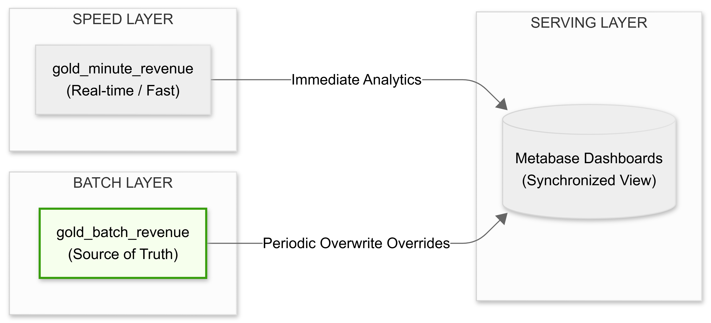

# Building and Optimizing an End-to-End Sales Data Pipeline on Apache Spark

<div align="center">

[](https://spark.apache.org/)
[](https://kafka.apache.org/)
[](https://airflow.apache.org/)
[](https://www.postgresql.org/)
[](https://www.docker.com/)
[](https://www.python.org/)

*A production-grade Lambda Architecture data pipeline for real-time and batch processing of large-scale sales transactions.*

[Architecture](#-system-architecture) · [Pipelines](#-deep-dive-processing-flows) · [Features](#-core-features) · [Quick Start](#-quick-start) · [Deployment](#-deployment-guide) · [Optimization](#-optimizations)

</div>

---

## 📌 Overview

This system is designed to **ingest, validate, transform, and aggregate** high-volume sales transaction data from decentralized sources. It implements the **Lambda Architecture** — combining a real-time **Streaming Pipeline** and a periodic **Batch Pipeline** on **Apache Spark** — with storage organized using the **Medallion Architecture** (Bronze → Silver → Gold) inside PostgreSQL. The entire infrastructure is containerized with **Docker** for high availability and horizontal scalability.

---

## 🏗 System Architecture

The system runs two parallel processing tracks, ensuring data is both immediately available for real-time alerting and fully reconciled for financial auditing.


*Figure 1: Overall Lambda and Medallion Architecture showing the convergence of Speed and Batch layers.*

### Global Lifecycle & Data Flow

| Stage | Component | Technical Execution |
|---|---|---|
| **Generation** | `data_producer.py` | Continuously emits JSON transaction events `{order_id, customer_id, product_id, amount, order_date}` with intentional dirty data injection. |
| **Ingestion** | Apache Kafka | Acts as a high-throughput buffer for raw streaming events inside the `sales_topic`. |
| **Storage** | PostgreSQL (Medallion) | **Bronze** (Raw First Persistence) → **Silver** (Cleaned/Validated) → **Gold** (Aggregated KPIs) + **DLQ** (`error_logs`). |
| **Orchestration** | Apache Airflow | Schedules periodic Batch ETL runs and manages automated DLQ error recovery loops. |
| **Serving** | Metabase / Telegram | BI Dashboards via Metabase engine; Event-driven VIP/System alerts delivered via Telegram Bots. |

---

## 🔍 Deep Dive: Processing Flows

To handle the trade-offs between processing latency and data completeness, the ingestion logic is strictly decoupled into distinct operational pipelines.

### 1. The Batch Layer (High-Fidelity Historical Pipeline)
Optimized for high volume, auditability, and data reconciliation. It enforces schema validation and applies column-based conversion prior to loading into the Medallion structures.


*Figure 2: Sequence of the Batch processing execution strictly following the CSV → Parquet → Gold Medallion flow.*

**Execution Lifecycle:**
1. **Landing:** Static transaction logs (`sales_data.csv`) land in the local storage volume.
2. **Silver Conversion:** Spark engine reads the raw CSV and writes an optimized, Snappy-compressed columnar snapshot (`sales_data.parquet`) to disk to optimize subsequent I/O.
3. **Gold Aggregation:** Spark applies business rules on the Silver Parquet file, filtering malformed rows to the Dead Letter Queue (`error_logs`) and overwriting aggregated revenue metrics to the Gold PostgreSQL table.
4. **Post-Commit Notification:** Upon successful database write transactions, Airflow triggers operational report summaries via the Telegram Bot.

### 2. The Speed Layer (Real-Time Streaming Pipeline)
Optimized for sub-second latency. It enriches raw transaction streams on the fly and triggers event-driven notifications for critical business actions.


*Figure 3: Real-time event consumption, metadata lookup enrichment, and commit-driven VIP alerting.*

**Execution Lifecycle:**
1. **Consumption:** `spark_streaming_job.py` consumes JSON payloads from Kafka micro-batches.
2. **First Persistence:** Raw streams are directly logged into the PostgreSQL Bronze table to guarantee re-processability.
3. **Enrichment & Routing:** Spark joins incoming streams with static catalog metadata (`product_info.csv`). Validated records pass to the Gold Layer, while anomalies are isolated into the DLQ.
4. **Event-Driven Alerting:** Immediately following a successful transaction commit to the Gold layer, high-value orders (`amount > $1000`) trigger batched HTTP payloads to the Telegram VIP channel.

---

## ✨ Core Features

- **Sub-second Distributed Stream Processing** — Processes high-throughput data streams from Kafka with minimal I/O overhead using Spark Structured Streaming micro-batches.
- **Centralized Dead Letter Queue (DLQ)** — Automatically isolates and classifies malformed records (`Missing Customer ID`, `Invalid Amount`) into a single audit table for root-cause analysis.
- **Automated Error Reprocessing** — A scheduled Airflow DAG recovers failed records, normalizes negative amounts to `0` (treated as promotional orders), and re-merges data directly into the Gold Layer.
- **Idempotency Guarantee** — Overwrite-mode snapshots for Batch and post-recovery database purges ensure repeated pipeline executions never skew financial reports.
- **Batched Telegram Alerts** — Dedicated bots for Streaming (`STREAMING_BOT`) and Batch (`BATCH_BOT`) pipelines. All VIP orders within a micro-batch are aggregated into a single HTTP POST payload, preventing Spark Driver thread-blocking and Telegram's HTTP 429 rate-limit errors.

---

## ⚡ Production Optimizations & Real Metrics

To ensure enterprise-grade stability under constrained containerized environments, the pipeline applies rigorous resource tuning and metadata pushdown techniques.

### 1. Spark Shuffle & Resource Tuning
- **Problem:** Spark's default `groupBy`/`window` operations create 200 shuffle partitions, overloading the internal Docker network I/O and RAM.
- **Solution:** Explicitly tuned `spark.sql.shuffle.partitions = 4` to match the allocated CPU core count.
- **Result:** **~85% reduction** in intermediate data processing time per micro-batch.

### 2. Alert Batching & Backpressure Control
- **Problem:** Firing individual HTTP requests per VIP order in a Streaming context blocks the Spark Driver thread and triggers `HTTP 429 Too Many Requests` from the Telegram API.
- **Solution:** Implemented partition-level micro-batch alert aggregation. All qualifying VIP transactions within a micro-batch are compiled into a single unified payload.

### 3. Columnar Storage & Metadata Pruning
- **Problem:** Raw CSV logs require full-table scans for aggregations and incur heavy disk footprints.
- **Solution:** Intermediate storage utilizes **Snappy-compressed Parquet** formats. Spark leverages **Predicate Pushdown** to filter invalid records directly at the file metadata layer before loading partitions into memory.
- **Result:** **~75% disk space reduction** paired with minimal read I/O overhead.

### 📊 Baseline System Metrics (Local Docker Environment)
Performance verified on a localized testing cluster executing parallel workloads:

| Metric Category | Observed Performance Target | Technical Context |
|---|---|---|
| **Ingestion Throughput** | `~50 - 80 events/sec` | Sustained generation rate via local Python simulation driver. |
| **End-to-End Latency** | `~10 - 15 seconds` | Measured from Kafka topic emission to post-commit Telegram VIP delivery. |
| **Daily Storage Footprint** | `~450 MB` (Raw CSV) $\rightarrow$ `~110 MB` (Parquet) | Demonstrates structural compression efficiency inside the Landing zone. |
| **Container Allocation** | **Spark Node:** `2 Cores, 4GB RAM` <br>**Kafka Broker:** `1 Core, 2GB RAM` <br>**Postgres DB:** `1 Core, 1.5GB RAM` | Minimum recommended baseline configurations for local Docker execution. |

## 🛠 Technology Stack

| Category | Technology |
|---|---|
| **Stream Processing** | Apache Spark 3.5.0 (PySpark), Structured Streaming |
| **Message Queue** | Apache Kafka 3.7.0, Zookeeper 3.9.2 |
| **Batch Orchestration** | Apache Airflow 2.9.0 (LocalExecutor) |
| **Storage** | PostgreSQL 15-alpine (Medallion Architecture) |
| **Visualization** | Metabase BI Engine |
| **Infrastructure** | Docker & Docker Compose 3.8 |
| **Language** | Python 3.8+ (`pandas`, `faker`, `psycopg2-binary`, `python-dotenv`) |

---

## 📂 Project Structure

```text
project-root/
├── dags/                           # Airflow DAG definitions
│   ├── reprocess_errors_dag.py     # DAG: automated error recovery (every 10 min)
│   └── sales_pipeline_dag.py       # DAG: data generation + Batch ETL orchestration
│
├── data/                           # Static data storage (CSV Landing, Parquet Silver)
│
├── logs/
│   └── spark_streaming.log         # Real-time Streaming job logs
│
├── src/                            # Core application source code
│   ├── data_producer.py            # Kafka producer: simulates real-time transactions + dirty data
│   ├── etl_job.py                  # Batch ETL: Parquet optimization + DLQ routing
│   ├── gen_data.py                 # Generates static CSV input for the Batch layer
│   ├── gen_product_metadata.py     # Generates product catalog metadata
│   ├── reprocess_errors.py         # Error recovery batch job + Data Purge logic
│   └── spark_streaming_job.py      # Streaming engine: micro-batch processing + batched alerts
│
├── .env                            # Environment variables (secrets — excluded via .gitignore)
├── docker-compose.yaml             # Full infrastructure definition
├── Dockerfile.airflow              # Custom Airflow worker image
└── init-db.sql                     # PostgreSQL schema initialization script
``` ---

## 🧪 Quality Assurance & Testing Strategy

To maintain pipeline integrity and avoid regressions during refactoring, the repository enforces continuous validation spanning unit, integration, and target metadata validation levels.

- **Local Spark Execution Testing:** ETL transformations and windowed metrics can be executed directly on local machine environments utilizing lightweight PySpark local sessions (`master="local[2]"`) combined with the `pytest` framework, eliminating the need to spin up the full Docker infrastructure during logic verification.
- **Unit & Integration Mapping:** Functional execution scripts assert targeted data extraction logic, guaranteeing that malformed configurations automatically trigger routing into the isolated DLQ structures.
- **Data Validation Guardrails:** Runtime PySpark validation checks assert strict schema invariants at the boundaries of the Medallion structures (e.g., asserting `df.filter(col("amount") < 0).count() == 0` prior to writing downstream to the Silver layer).

---

## ⚖️ Lambda Reconciliation & Eventual Consistency

A core architectural challenge in a Lambda infrastructure is maintaining analytical alignment between the real-time **Speed Layer** and the exhaustive **Batch Layer**.


*Figure 4: Lambda Reconciliation — Speed Layer divergence vs Batch Layer eventual convergence with idempotent conflict resolution.*

1. Target Synchronization & Convergence
Real-Time Divergence: Short-term reporting metrics materialized inside gold_minute_revenue provide immediate operational awareness but may exhibit minor discrepancies due to unexpected network jitter, late-arriving packets, or un-enriched partial events.

Eventual Convergence: Full synchronization is achieved at 10-minute intervals driven by Airflow DAG orchestration. The primary Batch task (etl_job.py) bypasses volatile streaming buffers to process consolidated records directly from the immutable Bronze persistence layer.

Conflict Resolution: Utilizing highly deterministic Idempotent Overwrites, the Batch layer replaces historical analytical aggregates. In the event of metric conflict, business intelligence tools configured inside Metabase enforce the Batch snapshot as the definitive Source of Truth.

## 🚀 Quick Start
Spin up the entire system locally in 3 steps:

Bash
# Step 1: Start all infrastructure containers in detached mode
docker-compose up -d

# Step 2: Launch the real-time Spark Streaming job inside the Docker network
docker exec -it newfolder2-spark-master-1 python3 /opt/spark/src/spark_streaming_job.py

# Step 3: (New terminal on host) Activate the virtual environment and start the data producer
# Windows (PowerShell)
.\.venv\Scripts\activate
python .\src\data_producer.py

# Linux / macOS
source .venv/bin/activate
python3 src/data_producer.py
📖 Deployment Guide
Step 1 — Configure Environment Variables
Create a .env file in the project root. Copy the template below and fill in your credentials:

Đoạn mã
# Telegram — Batch Pipeline Alerts
BATCH_BOT_TOKEN=<YOUR_TELEGRAM_BATCH_BOT_TOKEN>
BATCH_CHAT_ID=<YOUR_TELEGRAM_BATCH_CHAT_ID>

# Telegram — Streaming Pipeline Alerts
STREAMING_BOT_TOKEN=<YOUR_TELEGRAM_STREAMING_BOT_TOKEN>
STREAMING_CHAT_ID=<YOUR_TELEGRAM_STREAMING_CHAT_ID>

# PostgreSQL
DB_URL=jdbc:postgresql://postgres-db:5432/sales_db
DB_USER=admin
DB_PASS=<YOUR_POSTGRES_PASSWORD>
DB_DRIVER=org.postgresql.Driver

# Kafka
# For local Docker environment
KAFKA_BOOTSTRAP_SERVERS=kafka:29092

# For external connections (if needed)
# KAFKA_BOOTSTRAP_SERVERS=localhost:9092
KAFKA_TOPIC=sales_topic
Step 2 — Start Infrastructure & Database Initialization
Launch containers and initialize PostgreSQL schema via configured .env credentials:

```bash
docker-compose up -d
Note: Execute the full init-db.sql script via any external SQL client on port 5433 (or internal 5432) to map tables correctly prior to execution.

Step 3 — Enable Airflow Orchestration
Access the UI at http://localhost:8085 (admin/admin) and unpause:

sales_batch_optimization_v1

automated_data_recovery_job

##🐛 Troubleshooting
Cause: Default Spark Docker image omits the JDK jps utility.
Fix: Update the DAG's check command to map Linux process tables directly:

Bash
ps -ef | grep org.apache.spark.deploy.master.Master | grep -v grep
Cause: The error_logs table in PostgreSQL is missing the target enrichment key.
Fix: Connect to PostgreSQL directly and patch the schema:

SQL
ALTER TABLE error_logs ADD COLUMN product_id VARCHAR(255);
🔭 Roadmap
[ ] High-Availability Kafka Cluster — 3-node Kafka cluster with Replication Factor = 2 and multi-worker Spark setup for fault tolerance.

[ ] Delta Lake Integration — Replace plain Parquet with Delta Lake for ACID compliance, concurrent write optimization, and Data Time Travel for audit trails.

[ ] dbt Transformation Layer — Add dbt on top of PostgreSQL for modular SQL transformations, automated data quality tests, and lineage documentation.

## 📋 Prerequisites
- Docker 20.10+ & Docker Compose 3.8+
- Python 3.8+
- Git
- At least 8GB RAM (recommended 16GB for smooth operation)


## 📝 License
This project is licensed under the MIT License — see the [LICENSE](LICENSE) file for details.

## 🤝 Contributing
Contributions are welcome! Please feel free to submit a Pull Request.

👤 Author
Đặng Bùi Thanh Tùng Final-year student — Data Engineering · Faculty of Information Technology · Dai Nam University

This project serves as the capstone of my Data Engineering studies and as a stepping stone toward my career as a professional Data Engineer