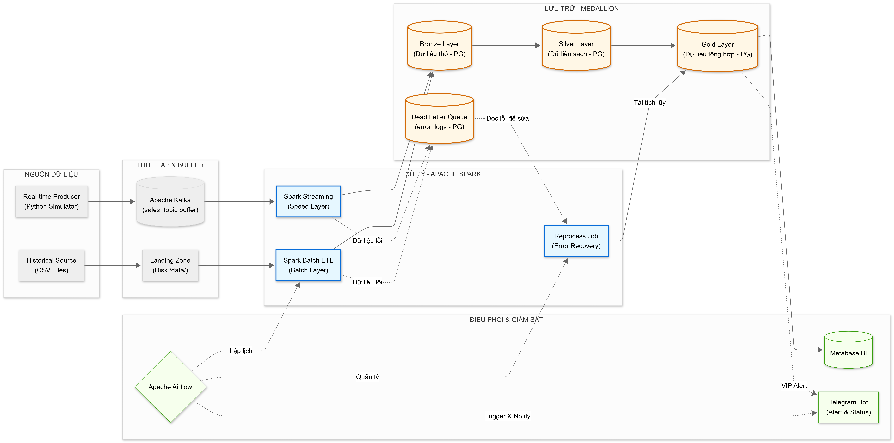
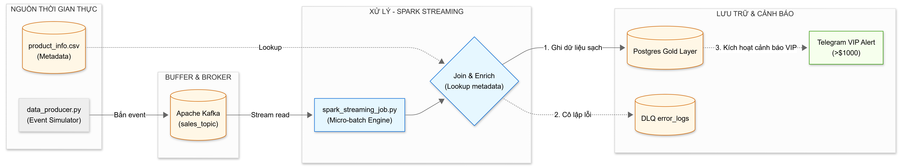
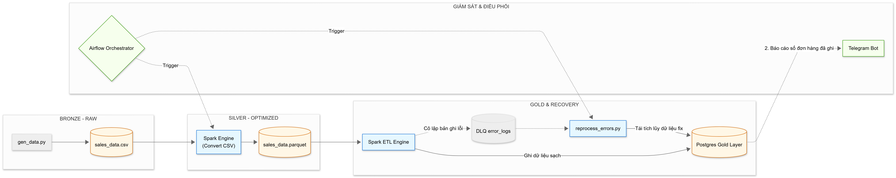

# Building an End-to-End Sales Data Pipeline on Apache Spark (Medallion / Lambda)

<div align="center">

[](https://spark.apache.org/)
[-231F20?style=for-the-badge&logo=apachekafka&logoColor=white)](https://kafka.apache.org/)
[](https://airflow.apache.org/)
[](https://www.postgresql.org/)
[](https://www.docker.com/)
[](https://www.python.org/)
[](.github/workflows/ci.yml)

*A Lambda Architecture data pipeline with a fully implemented Medallion storage
layer (Bronze → Silver → Gold) for real-time and batch processing of sales transactions.*

[Architecture](#-system-architecture) · [Pipelines](#-deep-dive-processing-flows) · [Features](#-core-features) · [Data Quality](#-data-quality--dlq-lifecycle) · [Quick Start](#-quick-start) · [Testing](#-quality-assurance--testing)

</div>

---

## 📌 Overview

This system **ingests, validates, transforms, and aggregates** sales transaction
data from two converging sources. It implements the **Lambda Architecture** — a
real-time **Speed Layer** and a periodic **Batch Layer** on Apache Spark — with
storage organized using the **Medallion Architecture** inside PostgreSQL:

| Layer | Table | Who writes | Who reads |
|---|---|---|---|
| **Bronze** | `raw_sales_events` | Streaming (raw Kafka JSON) + Batch (CSV landing ingest) | Batch ETL |
| **Silver** | `clean_sales_events` | Streaming (UPSERT by `order_id`) + Batch (append new IDs) | Batch Gold aggregation |
| **Gold (Speed)** | `gold_minute_revenue` | Streaming + DLQ recovery (UPSERT by window × product) | Metabase |
| **Gold (Batch)** | `gold_batch_revenue` | Batch ETL (recomputed from Silver, atomic swap) | Metabase — **Source of Truth** |
| **DLQ** | `error_logs` | Both layers (append, with lifecycle `status`) | Recovery DAG |

Everything runs containerized with Docker Compose (Kafka in KRaft mode — no Zookeeper).

---

## 🏗 System Architecture



### Global Lifecycle & Data Flow

| Stage | Component | What actually happens |
|---|---|---|
| **Generation** | `data_producer.py` | Emits JSON events keyed by `customer_id` (ordering per customer), `acks=all`, with deliberate dirty-data injection (~6%). |
| **Ingestion** | Apache Kafka (KRaft) | `sales_topic` buffers raw events between producer and Spark. |
| **Bronze** | `raw_sales_events` | Streaming persists every raw payload verbatim; the batch DAG also ingests the static CSV landing file into the same table. |
| **Silver** | `clean_sales_events` | Validated records, deduplicated by `order_id` — written idempotently by both layers. |
| **Gold** | `gold_minute_revenue`, `gold_batch_revenue` | Minute-grain speed view and date-grain batch view (see [Reconciliation](#%EF%B8%8F-lambda-reconciliation)). |
| **Orchestration** | Apache Airflow | Batch pipeline every 10 min; DLQ recovery every 15 min. |
| **Serving** | Metabase / Telegram | BI dashboards; batched VIP alerts via the Streaming bot, ETL reports via the Batch bot. |

---

## 🔍 Deep Dive: Processing Flows

### 1. The Speed Layer (Real-Time Streaming) — `spark_streaming_job.py`

Five concurrent streaming queries over one Kafka source, each with its own
checkpoint on a mounted volume and a 10-second micro-batch trigger:

| # | Circuit | Sink |
|---|---|---|
| 0 | **Bronze** — raw JSON persisted verbatim (re-processable at any time) | `raw_sales_events` (append) |
| 1 | **Silver** — clean records UPSERTed by `order_id` | `clean_sales_events` |
| 2 | **Gold** — revenue per (1-minute window × product), UPSERT by table PK | `gold_minute_revenue` |
| 3 | **Alert** — orders > $1000, aggregated per micro-batch into one Telegram POST | Streaming bot |
| 4 | **DLQ** — malformed records with classified reasons | `error_logs` (append) |

All writes are **idempotent**: losing a checkpoint and replaying from the
earliest offset re-UPSERTs the same keys instead of duplicating data.



### 2. The Batch Layer (High-Fidelity Historical Pipeline) — `etl_job.py`

Airflow DAG `sales_batch_optimization_v1`, every 10 minutes:

1. **Metadata** — `gen_product_metadata.py` is *idempotent*: the catalog is created
   once and never regenerated (product names no longer drift between runs).
2. **Landing** — `gen_data.py` writes a fresh `sales_data.csv`.
3. **Landing → Bronze** — `ingest_csv_to_bronze.py` converts the CSV to the same
   JSON payload shape as the stream and appends it to Bronze. This is what makes
   batch/stream convergence real: **both sources meet in one Bronze table**.
4. **Batch ETL** — reads Bronze (not the CSV), routes clean records into Silver
   (append only new `order_id`s via anti-join), isolates errors into the DLQ,
   then **recomputes Gold from Silver** and swaps it in atomically:

```
gold_agg  →  gold_batch_revenue_staging  →  [BEGIN; DELETE gold; INSERT..SELECT; COMMIT]
```

The atomic swap preserves the Primary Key (the old `mode("overwrite")` used to
DROP the table and silently destroy it) and never exposes an empty table to Metabase.



> Sơ đồ PNG mô tả kiến trúc tổng quát; luồng batch hiện tại có thêm bước
> "Landing → Bronze" như trên (cập nhật figure nằm trong Roadmap).

---

## ✨ Core Features

- **Real Medallion flow** — Bronze is written *and* read; Silver is populated by
  both layers; Gold is derived from Silver (including recovered records).
- **Idempotent writes everywhere** — UPSERT (`INSERT ... ON CONFLICT`) for
  streaming sinks and recovery; anti-join append for batch Silver; transactional
  staging swap for batch Gold. Re-running any job never skews reports.
- **DLQ with a lifecycle** — `error_logs.status` (`unprocessed` → `processed`).
  The recovery DAG reads *only* unprocessed rows it can fix, then marks exactly
  the IDs it processed — no blind `DELETE`, no race window, no data loss.
- **Refund-aware recovery** — negative amounts are recovered with their sign
  preserved (a refund legitimately reduces revenue), instead of being forced to 0.
- **Batched Telegram alerts** — one HTTP POST per micro-batch, avoiding driver
  blocking and Telegram HTTP 429 rate limits; separate bots for Batch/Streaming.
- **Null-safe quality routing** — NULL `amount`/`order_id` rows land in the DLQ
  instead of silently vanishing from both sides of the filter (a real bug in the
  previous version, now covered by regression tests).
- **Exact money arithmetic** — every currency column is `NUMERIC(12,2)` end-to-end
  (Spark `DecimalType` casts + Postgres `NUMERIC`); floats never touch money, so
  aggregated revenue is penny-exact.
- **Operable compose stack** — Kafka KRaft (no Zookeeper), healthchecks +
  `depends_on` conditions, restart policies, checkpoints on a host volume,
  schema auto-init via `docker-entrypoint-initdb.d`, pinned dependencies baked
  into the Spark image.

---

## 📐 Data Quality & DLQ Lifecycle

Shared routing rules (single source in `src/transforms.py`, tested with pytest):

| Condition | Classification | Destination |
|---|---|---|
| `customer_id IS NULL` | `Missing Customer ID` | DLQ |
| `amount IS NULL OR amount <= 0` | `Invalid Amount` | DLQ → recovery (refund semantics) |
| `order_id IS NULL OR ''` | `Missing Order ID` | DLQ (manual review) |
| `product_id IS NULL/'' ` (after trim) | `Missing Product ID` | DLQ |
| otherwise | clean | Silver → Gold |

Recovery (`reprocess_errors.py`, every 15 min): `status='unprocessed'` AND
`Invalid Amount` → UPSERT into Silver with the original sign → refresh the minute
view → mark `processed` for exactly the recovered IDs.

---

## ⚡ Engineering Optimizations & Honest Metrics

- **`spark.sql.shuffle.partitions = 4`** tuned for the container's CPU count —
  200 default partitions would choke the Docker network for tiny micro-batches.
- **Micro-batch trigger = 10s** — matches alert batching and keeps JDBC round-trips sane.
- **Snappy Parquet** as the intermediate batch format (columnar, compressed).
- **Measured on the local stack** (no invented percentages — measure your own run):
  - Producer rate: **~15–20 events/s** (bounded by `time.sleep(0.05)` — by design).
  - End-to-end latency (event → Telegram/Gold): **~10–15 s** (micro-batch trigger).
  - Container baseline: Spark node 1.5G, Kafka 1G, Postgres 512M, Metabase 2G.

---

## 🛠 Technology Stack

| Category | Technology |
|---|---|
| Stream Processing | Apache Spark 3.5.0 (PySpark), Structured Streaming |
| Message Queue | Apache Kafka 3.7.0 (KRaft mode) |
| Batch Orchestration | Apache Airflow 2.9.1 (LocalExecutor) |
| Storage | PostgreSQL 15-alpine (Medallion) |
| Visualization | Metabase |
| Infrastructure | Docker Compose, `Dockerfile.spark` / `Dockerfile.airflow` |
| Language | Python (pyspark, kafka-python, psycopg2, pandas, faker) — pinned in `requirements.txt` |
| Testing / CI | pytest (+ PySpark local session), GitHub Actions |

---

## 📂 Project Structure

```text
project-root/
├── dags/
│   ├── sales_pipeline_dag.py       # Landing CSV → Bronze ingest → Batch ETL (10 min)
│   └── reprocess_errors_dag.py     # DLQ lifecycle recovery (15 min)
│
├── src/
│   ├── db_utils.py                 # Config, JDBC parse, UPSERT/swap helpers (shared)
│   ├── transforms.py               # Quality routing + Gold aggregations (shared, tested)
│   ├── notify.py                   # Telegram helper (Batch/Streaming bots)
│   ├── data_producer.py            # Kafka producer: keyed messages, acks=all, dirty data
│   ├── ingest_csv_to_bronze.py     # Landing CSV → Bronze (convergence point)
│   ├── etl_job.py                  # Bronze → Silver → Gold (atomic swap)
│   ├── spark_streaming_job.py      # 5 streaming circuits (Bronze/Silver/Gold/Alert/DLQ)
│   ├── reprocess_errors.py         # DLQ recovery + status lifecycle
│   ├── gen_data.py                 # CSV landing generator
│   └── gen_product_metadata.py     # Product catalog (idempotent — runs once)
│
├── tests/
│   ├── test_db_utils.py            # Pure-Python unit tests (run anywhere)
│   └── test_transforms.py          # PySpark local-session tests (CI runs these)
│
├── docs/
│   └── architecture-review.md      # Full review: gaps found + fix plan + status
│
├── migrations/
│   └── 001_amount_to_numeric.sql   # Live-DB migration (money columns → NUMERIC)
│
├── data/                           # Landing CSV + product catalog (idempotent)
├── logs/ checkpoints/              # Runtime artifacts (gitignored)
├── .github/workflows/ci.yml        # pytest + docker compose validation
├── docker-compose.yaml
├── Dockerfile.spark / Dockerfile.airflow
├── init-db.sql                     # Medallion schema (auto-applied on first init)
└── requirements.txt                # Pinned dependencies
```

---

## 🧪 Quality Assurance & Testing

*(Phần này giờ đúng với code thật — trước đây là tuyên bố không có hồ sơ.)*

- **Unit tests** (`pytest tests/`):
  - `test_db_utils.py` — JDBC URL parsing, error handling (pure Python).
  - `test_transforms.py` — quality routing (each error class + the NULL-vanish
    regression) and Gold aggregation grains, on a local Spark session `local[2]`.
- **Run locally:**
  ```bash
  .venv/Scripts/python -m pytest tests/ -v      # Windows
  python3 -m pytest tests/ -v                   # Linux / macOS
  ```
  Machines where PySpark can't start (e.g. Windows paths containing `(` like
  `New folder (2)` break Spark's batch scripts) gracefully **skip** the Spark
  tests — CI runs them fully on Ubuntu + Java 17 + Python 3.11.
- **CI** (`.github/workflows/ci.yml`): runs the full test suite and validates
  `docker compose config` on every push/PR.
- **Secret hygiene:** `pre-commit` + `detect-secrets` blocks credentials from
  ever being committed. Install once: `pip install pre-commit && pre-commit install`.

---

## ⚖️ Lambda Reconciliation (implemented, not just claimed)

1. **Short-term divergence** — `gold_minute_revenue` reflects streaming windows
   and may miss late/replayed events; that is acceptable for an operational view.
2. **Eventual convergence** — every 10 minutes the batch DAG recomputes Gold from
   Silver, which accumulates clean records from *both* layers plus recovered DLQ
   rows. Bronze converges CSV landing and the stream in one immutable table.
3. **Conflict resolution** — Gold Batch is rebuilt via a single-transaction
   atomic swap; Metabase reads `gold_batch_revenue` as the Source of Truth.

---

## 🚀 Quick Start

```bash
# Step 1: start the whole stack (Postgres schema auto-initializes on first run)
docker compose up -d --build

# Step 2: launch the streaming job inside the Docker network
docker exec -it newfolder2-spark-master-1 spark-submit \
  --packages org.apache.spark:spark-sql-kafka-0-10_2.12:3.5.0,org.postgresql:postgresql:42.7.2 \
  /opt/spark/src/spark_streaming_job.py

# Step 3: start the producer (inside the container — no host deps needed)
docker exec -it newfolder2-spark-master-1 python3 /opt/spark/src/data_producer.py
```

Prefer running the producer on the host? Make sure `KAFKA_BOOTSTRAP_SERVERS`
in `.env` points at `localhost:9092` for the host process (the Spark jobs need
`kafka:29092` — that's why the in-container run is the default path).

Airflow UI: http://localhost:8085 (admin/admin) — unpause
`sales_batch_optimization_v1` and `automated_data_recovery_job`.
Metabase: http://localhost:3000 — point it at Postgres **`postgres-db:5432`**
(Metabase nằm trong cùng mạng compose nên dùng hostname nội bộ — port host-mapped
`localhost:5433` chỉ dành cho tool trên máy, vd DBeaver), db `sales_db`.

---

## 📖 Deployment Guide

**Step 1 — Configure `.env`** (copy `.env.example`, fill real values — never
commit the filled file):

```env
# Telegram — Batch Pipeline Alerts
BATCH_BOT_TOKEN=<YOUR_TELEGRAM_BATCH_BOT_TOKEN>
BATCH_CHAT_ID=<YOUR_TELEGRAM_BATCH_CHAT_ID>

# Telegram — Streaming Pipeline Alerts
STREAMING_BOT_TOKEN=<YOUR_TELEGRAM_STREAMING_BOT_TOKEN>
STREAMING_CHAT_ID=<YOUR_TELEGRAM_STREAMING_CHAT_ID>

# PostgreSQL (Medallion storage)
DB_URL=jdbc:postgresql://postgres-db:5432/sales_db
DB_USER=admin
DB_PASS=<YOUR_POSTGRES_PASSWORD>
DB_DRIVER=org.postgresql.Driver

# Kafka (inside Docker network)
KAFKA_BOOTSTRAP_SERVERS=kafka:29092
KAFKA_TOPIC=sales_topic
```

**Step 2 — Start infrastructure**: `docker compose up -d --build`. The schema in
`init-db.sql` is applied automatically the first time the Postgres volume is
created (no manual SQL execution needed).

**Step 3 — Enable Airflow DAGs** in the UI (see Quick Start).

---

## 🐛 Troubleshooting

- **Spark Master health check fails** — the Spark image omits the JDK `jps`
  utility; the DAG maps the Linux process table instead:
  `ps -ef | grep org.apache.spark.deploy.master.Master | grep -v grep`.
- **PySpark won't start locally on Windows** — paths containing parentheses
  (e.g. `New folder (2)`) break Spark's `.cmd` scripts
  (`was unexpected at this time`). Rename the folder or run the tests in WSL/CI.
- **Schema drift after an old version ran** — if your Postgres volume predates
  this refactor (tables created by Spark without constraints), wipe the volume
  (`docker compose down -v`) and start fresh so `init-db.sql` applies cleanly.

---

## 🔭 Roadmap

- [ ] Update architecture figures to include the Landing → Bronze ingest step
- [ ] Incremental batch processing (high-watermark on Bronze) instead of full recompute
- [ ] Delta Lake for ACID + time travel on the Parquet layer
- [ ] dbt for modular SQL transformations and lineage
- [ ] High-Availability Kafka (RF=2) + multi-worker Spark
- [ ] Schema Registry for the event payload contract

---

## 📋 Prerequisites

- Docker 20.10+ & Docker Compose v2
- Python 3.8+ (for local tests)
- Git (+ `pre-commit` recommended)
- At least 8GB RAM (16GB recommended)

## 📝 License

MIT — see [LICENSE](LICENSE).

## 👤 Author

Đặng Bùi Thanh Tùng — Final-year student, Data Engineering · Faculty of
Information Technology · Dai Nam University

This project serves as the capstone of my Data Engineering studies and as a
stepping stone toward my career as a professional Data Engineer.
