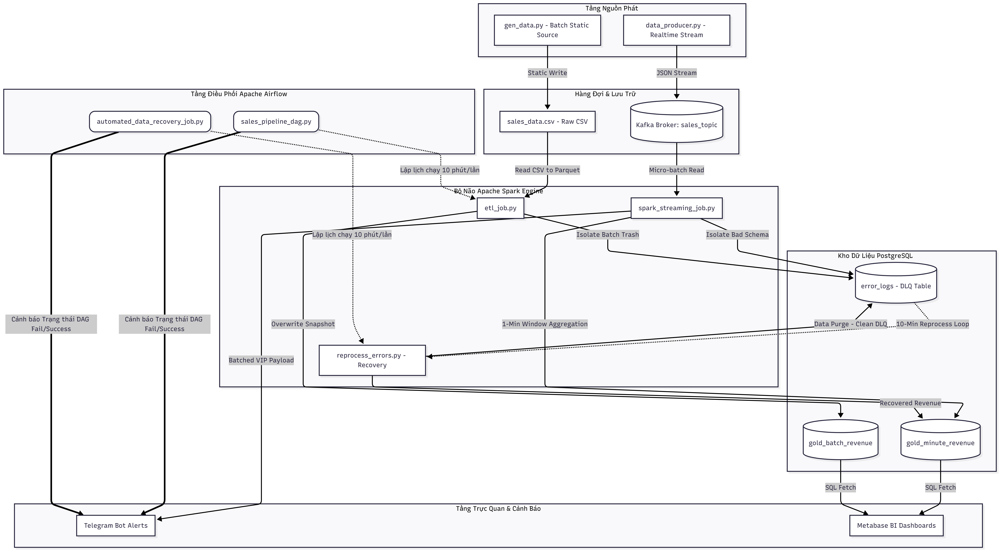

# 🚀 Enterprise Sales Data Pipeline on Apache Spark

<div align="center">

[](https://spark.apache.org/)
[](https://kafka.apache.org/)
[](https://airflow.apache.org/)
[](https://www.postgresql.org/)
[](https://www.docker.com/)
[](https://www.python.org/)

*A production-grade Lambda Architecture data pipeline for real-time and batch processing of large-scale sales transactions.*

[Architecture](#-system-architecture) · [Features](#-core-features) · [Quick Start](#-quick-start) · [Deployment Guide](#-deployment-guide) · [Optimization](#-optimizations) · [Roadmap](#-roadmap)

</div>

---

## 📌 Overview

This system is designed to **ingest, validate, transform, and aggregate** high-volume sales transaction data from decentralized sources. It implements the **Lambda Architecture** — combining a real-time **Streaming Pipeline** and a periodic **Batch Pipeline** on **Apache Spark** — with storage organized using the **Medallion Architecture** (Bronze → Silver → Gold) inside PostgreSQL. The entire infrastructure is containerized with **Docker** for high availability and horizontal scalability.

---

## 🏗 System Architecture

The system runs two parallel processing tracks, ensuring data is both immediately available for monitoring and fully accurate for financial auditing.



### Data Flow

| Stage | Component | Description |
|---|---|---|
| **Generation** | `data_producer.py` | Continuously emits JSON transaction events `{order_id, customer_id, product_id, amount, order_date}` with intentional dirty data injection for testing |
| **Ingestion** | Apache Kafka | Buffers raw events in `sales_topic` via internal Docker network (`kafka:29092`) |
| **Speed Layer** | Spark Structured Streaming | Consumes micro-batches → Bronze Layer → filters clean records to Silver → aggregates to `gold_minute_revenue` rolling window; invalid records routed to DLQ (`error_logs`) |
| **Batch Layer** | Spark Batch (`etl_job.py`) | Reads static `sales_data.csv`, converts to Snappy-compressed Parquet, pushes errors to DLQ, writes clean snapshot to `gold_batch_revenue` with overwrite mode |
| **Orchestration** | Apache Airflow | Schedules Spark jobs every 10 minutes; triggers `reprocess_errors.py` to correct negative-amount orders, re-aggregate metrics, and purge stale data |
| **Serving** | PostgreSQL → Metabase / Telegram Bot | BI dashboards via Metabase; VIP order alerts (> $1,000) pushed to Telegram |

---

## ✨ Core Features

- **Sub-second Distributed Stream Processing** — Processes high-throughput data streams from Kafka with minimal I/O overhead using Spark Structured Streaming micro-batches.

- **Centralized Dead Letter Queue (DLQ)** — Automatically isolates and classifies malformed records (`Missing Customer ID`, `Invalid Amount`) into a single audit table for root-cause analysis.

- **Automated Error Reprocessing** — A scheduled Airflow DAG recovers failed records, normalizes negative amounts to `0` (treated as promotional orders), and re-merges data directly into the Gold Layer.

- **Idempotency Guarantee** — Overwrite-mode snapshots for Batch and post-recovery database purges ensure repeated pipeline executions never skew financial reports.

- **Batched Telegram Alerts** — Dedicated bots for Streaming (`STREAMING_BOT`) and Batch (`BATCH_BOT`) pipelines. All VIP orders within a micro-batch are aggregated into a single HTTP POST payload, preventing Spark Driver thread-blocking and Telegram's HTTP 429 rate-limit errors.

---

## ⚡ Optimizations

### 1. Spark Shuffle Tuning
**Problem:** Spark's default `groupBy`/`window` operations create 200 shuffle partitions, overloading internal Docker network I/O and RAM.

**Solution:** Forced `spark.sql.shuffle.partitions = 4` to match actual CPU core count.

> **Result:** ~85% reduction in intermediate data processing time per micro-batch.

---

### 2. Telegram API Rate-Limit Control
**Problem:** Sending individual HTTP requests per VIP order in a Streaming job blocks the Spark Driver thread and triggers `HTTP 429 Too Many Requests` from the Telegram API.

**Solution:** Implemented alert batching — all qualifying records within a micro-batch are concatenated into a single string and sent as one HTTP POST request.

---

### 3. Storage Format Optimization
**Problem:** CSV format requires full table scans for every computation and consumes excessive disk space.

**Solution:** Upgraded the Batch layer to **Snappy-compressed Parquet** columnar format, leveraging **Predicate Pushdown** to skip invalid data blocks at the metadata level.

> **Result:** ~75% disk space reduction; significant I/O improvement via column pruning.

---

## 🛠 Technology Stack

| Category | Technology |
|---|---|
| **Stream Processing** | Apache Spark 3.5.0 (PySpark), Structured Streaming |
| **Message Queue** | Apache Kafka 3.7.0, Zookeeper 3.9.2 |
| **Batch Orchestration** | Apache Airflow 2.9.0 (LocalExecutor) |
| **Storage** | PostgreSQL 15-alpine (Medallion Architecture) |
| **Visualization** | Metabase BI Engine |
| **Infrastructure** | Docker & Docker Compose 3.8 |
| **Language** | Python 3.8+ (`pandas`, `faker`, `psycopg2-binary`, `python-dotenv`) |

---

## 📂 Project Structure

```
project-root/
├── dags/                           # Airflow DAG definitions
│   ├── reprocess_errors_dag.py     # DAG: automated error recovery (every 10 min)
│   └── sales_pipeline_dag.py       # DAG: data generation + Batch ETL orchestration
│
├── data/                           # Static data storage (CSV, Parquet)
│
├── logs/
│   └── spark_streaming.log         # Real-time Streaming job logs
│
├── src/                            # Core application source code
│   ├── data_producer.py            # Kafka producer: simulates real-time transactions + dirty data
│   ├── etl_job.py                  # Batch ETL: Parquet optimization + DLQ routing
│   ├── gen_data.py                 # Generates static CSV input for the Batch layer
│   ├── gen_product_metadata.py     # Generates product catalog metadata
│   ├── reprocess_errors.py         # Error recovery batch job + Data Purge logic
│   └── spark_streaming_job.py      # Streaming engine: micro-batch processing + batched alerts
│
├── .env                            # Environment variables (secrets — excluded via .gitignore)
├── .gitignore
├── docker-compose.yaml             # Full infrastructure definition
├── Dockerfile.airflow              # Custom Airflow worker image
└── init-db.sql                     # PostgreSQL schema initialization script
```

---

## 🚀 Quick Start

Spin up the entire system locally in 3 steps:

```bash
# Step 1: Start all infrastructure containers in detached mode
docker-compose up -d

# Step 2: Launch the real-time Spark Streaming job inside the Docker network
docker exec -it newfolder2-spark-master-1 python3 /opt/spark/src/spark_streaming_job.py

# Step 3: (New terminal on host) Activate the virtual environment and start the data producer
# Windows (PowerShell)
.\.venv\Scripts\activate
python .\src\data_producer.py

# Linux / macOS
source .venv/bin/activate
python3 src/data_producer.py
```

---

## 📖 Deployment Guide

### Step 1 — Configure Environment Variables

Create a `.env` file in the project root. Copy the template below and fill in your credentials:

```dotenv
# Telegram — Batch Pipeline Alerts
BATCH_BOT_TOKEN=<YOUR_TELEGRAM_BATCH_BOT_TOKEN>
BATCH_CHAT_ID=<YOUR_TELEGRAM_BATCH_CHAT_ID>

# Telegram — Streaming Pipeline Alerts
STREAMING_BOT_TOKEN=<YOUR_TELEGRAM_STREAMING_BOT_TOKEN>
STREAMING_CHAT_ID=<YOUR_TELEGRAM_STREAMING_CHAT_ID>

# PostgreSQL
DB_URL=jdbc:postgresql://postgres-db:5432/sales_db
DB_USER=admin
DB_PASS=<YOUR_POSTGRES_PASSWORD>
DB_DRIVER=org.postgresql.Driver

# Kafka
KAFKA_BOOTSTRAP_SERVERS=kafka:29092
KAFKA_TOPIC=sales_topic
```

### Step 2 — Start the Infrastructure

```bash
docker-compose up -d
```

### Step 3 — Initialize the Database Schema

Connect to PostgreSQL via a SQL client (e.g., DBeaver, pgAdmin) using:
- **Host:** `localhost` | **Port:** `5433` (external) or `5432` (internal Docker network)
- **Credentials:** as configured in `.env`

Execute the full `init-db.sql` script to create all required tables.

### Step 4 — Start the Streaming Job

```bash
docker exec -it newfolder2-spark-master-1 python3 /opt/spark/src/spark_streaming_job.py
```

**Expected log output:**
```
INFO MicroBatchExecution: Streaming query made progress: {
  "batchId" : 29,
  "numInputRows" : 10,
  "inputRowsPerSecond" : 19.19,
  "processedRowsPerSecond" : 21.78,
  "sources" : [ { "description" : "KafkaV2[Subscribe[sales_topic]]" } ],
  "sink" : { "description" : "ForeachBatchSink" }
}
```

### Step 5 — Start the Data Producer

```bash
# Windows
.\.venv\Scripts\activate && python .\src\data_producer.py

# Linux / macOS
source .venv/bin/activate && python3 src/data_producer.py
```

### Step 6 — Enable Airflow DAGs

1. Open the Airflow Web UI: **http://localhost:8085** (credentials: `admin` / `admin`)
2. Locate and **unpause** both DAGs:
   - `sales_batch_optimization_v1`
   - `automated_data_recovery_job`

**Expected result:** All 4 tasks in the pipeline turn green (Success):
```
generate_product_metadata → generate_raw_sales_data → check_spark_master_health → run_spark_batch_etl
```

---

## 🐛 Troubleshooting

<details>
<summary><b>Q1: Airflow task <code>check_spark_master_health</code> fails (red)</b></summary>

**Cause:** The default Spark Docker image does not include the JDK `jps` utility.

**Fix:** Update the DAG's health-check command to query the Linux process table directly:
```bash
ps -ef | grep org.apache.spark.deploy.master.Master | grep -v grep
```
</details>

<details>
<summary><b>Q2: Spark throws <code>AnalysisException: Column 'product_id' not found</code></b></summary>

**Cause:** The `error_logs` table in PostgreSQL is missing the `product_id` column.

**Fix:** Connect to the database and run:
```sql
ALTER TABLE error_logs ADD COLUMN product_id VARCHAR(255);
```
Or re-execute the full `init-db.sql` script.
</details>

<details>
<summary><b>Q3: Telegram alerts not sending — log shows <code>HTTP Error 429 Too Many Requests</code></b></summary>

**Cause:** `data_producer.py` is generating VIP orders too frequently, exceeding the Telegram API rate limit.

**Fix (choose one):**
- Increase the producer's sleep interval: `time.sleep(0.5)` → `time.sleep(2)`
- Raise the VIP threshold in the Streaming job: `col("amount") > 1000` → `col("amount") > 5000`
</details>

---

## 🔭 Roadmap

Planned enhancements to evolve this local development setup into a production-ready enterprise system:

- [ ] **High-Availability Kafka Cluster** — 3-node Kafka cluster with `Replication Factor = 2` and multi-worker Spark setup for fault tolerance.
- [ ] **Delta Lake Integration** — Replace plain Parquet with Delta Lake for ACID compliance, concurrent write optimization, and Data Time Travel for audit trails.
- [ ] **dbt Transformation Layer** — Add dbt on top of PostgreSQL for modular SQL transformations, automated data quality tests, and lineage documentation.
- [ ] **Centralized Monitoring** — Deploy Prometheus + Grafana dashboards to track Spark Executor resource consumption and fire automated Telegram alerts on resource saturation.

---

## 👤 Author

**Đặng Bùi Thanh Tùng**

Final-year student — Data Engineering · Faculty of Information Technology · Dai Nam University

> *This project serves as the capstone of my Data Engineering studies and as a stepping stone toward my career as a professional Data Engineer.*

---

<div align="center">

If you found this project useful, please consider giving it a ⭐

</div>